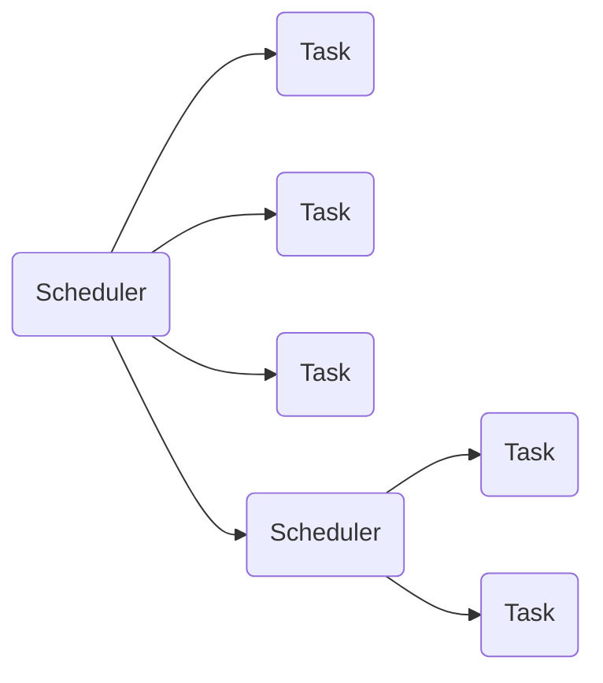

[](LICENSE)

# uCosm

Lightweight C++17 scheduler library for microcontrollers supporting cooperative and real-time scheduling.

**Key Features:**
- No heap allocation
- No task number limitations
- Platform independent
- Hierarchical scheduling trees
- Multiple scheduling policies: Cooperative, Fair, and Real-time
- Customizable scheduling algorithms



This library provides a modular scheduling framework with three main implementations:

| Scheduler | Type | Execution | Use Case |
|-----------|------|-----------|----------|
| **Periodic** | Cooperative | Time-based intervals | Regular maintenance tasks |
| **CFS** | Cooperative | Priority-based fair sharing | CPU-intensive workloads |
| **RT** | Real-time | Hardware timer interrupts | Deterministic real-time systems |

- **Core**: Basic cooperative scheduler foundation
- **Periodic**: Time-based cooperative task scheduling  
- **CFS**: Completely Fair Scheduler with priority-based execution
- **RT**: Real-time scheduler with hardware timer integration

# Examples

## Periodic Scheduler

Time-based cooperative scheduling where tasks execute at defined intervals.

```cpp
#include <iostream>
#include "periodic/iperiodic_task.hpp"

struct Task final : ucosm::IPeriodicTask {
    void run() override {
        std::cout << "run " << this->getPeriod() << std::endl;
        if(mCounter++ == 10) {
            this->remove();
        }
    }
    int mCounter = 0;
};
```

```cpp
#include <chrono>
#include "periodic/periodic_scheduler.hpp"

static ucosm::IPeriodicTask::tick_t getTick_ms() {
    return static_cast<ucosm::IPeriodicTask::tick_t>(
        std::chrono::duration_cast<std::chrono::milliseconds>(
            std::chrono::system_clock::now().time_since_epoch()
        ).count()
    );
}

int main() {

    ucosm::PeriodicScheduler sched(getTick_ms);

    Task t1;
    Task t2;

    t1.setPeriod(50);    // execute every 50 milliseconds
    t2.setPeriod(1000);  // execute every seconds

    sched.addTask(t1);
    sched.addTask(t2);

    while(!sched.empty()) {
        sched.run();
    }

    return 0;
}
```

## CFS (Completely Fair Scheduler)

Priority-based cooperative scheduling with automatic time-slicing for fair execution.

```cpp
#include <iostream>
#include "cfs/icfs_task.hpp"

struct Task final : ucosm::ICFSTask {
    void run() override {
        std::cout << "run " << (uint16_t)this->getPriority() << std::endl;
        if(mCounter++ == 10) {
            this->remove();
        }
    }
    int mCounter = 0;
};
```

```cpp
#include <chrono>
#include "cfs/cfs_scheduler.hpp"

int main() {

    ucosm::CFSScheduler sched(getTick_us);

    Task t1;
    Task t2;

    t1.setPriority(2);
    t2.setPriority(4);

    sched.addTask(t1);
    sched.addTask(t2);

    while(!sched.empty()) {
        sched.run();
    }

    return 0;
}
```

## Real-Time (RT) Scheduler

Interrupt timer-based scheduling for real-time applications.

The RT scheduler provides deterministic task execution using platform-specific timers. On microcontrollers, it uses dedicated hardware timers with interrupt priorities. On desktop platforms, the same interface can be implemented using high-resolution threads for development and testing purposes.

Timing accuracy depends on the collective workload of all tasks within a scheduler. For maximum determinism, multiple schedulers can be created with timers of different interrupt priorities.

```cpp
#include <iostream>
#include "ucosm/periodic/iperiodic_task.hpp"

struct RTTask final : ucosm::IPeriodicTask {
    RTTask(uint32_t period_ms) : ucosm::IPeriodicTask(period_ms) {}
    
    void run() override {
        std::cout << "RT task executed at " << getPeriod() << "ms period\n";
        if(mCounter++ == 10) {
            this->removeTask();
        }
    }
    int mCounter = 0;
};
```

```cpp
#include "ucosm/rt/rt_scheduler.hpp"

// Hardware timer or thread implementation (platform-specific)
class Timer : public ucosm::RTScheduler::ITimer {
    // Implement virtual methods for your platform
    void start() override { /* Start timer */ }
    void stop() override { /* Stop timer */ }
    bool isRunning() const override { /* Check timer status */ }
    void setDuration(uint32_t duration) override { /* Set timer period */ }
    void disable() override { /* Disable timer */ }
    void enable() override { /* Enable timer */ }
};

int main() {
    Timer timer;
    ucosm::RTScheduler scheduler;
    scheduler.setTimer(timer);

    RTTask task1(100);  // Execute every 100ms
    RTTask task2(500);  // Execute every 500ms

    scheduler.addTask(task1);
    scheduler.addTask(task2);

    // Tasks execute automatically via timer interrupts
    while(!scheduler.empty()) {
        // Main loop can handle other work
    }

    return 0;
}
```

# Hierarchical Scheduling

Schedulers can be nested as tasks within other schedulers, creating flexible scheduling hierarchies.

**Example**: Periodic scheduler containing a CFS scheduler containing another periodic scheduler.

```cpp
ucosm::PeriodicScheduler<ucosm::ICFSTask> periodicScheduler(getTick_ms);

ucosm::CFSScheduler<ucosm::IPeriodicTask> cfsScheduler(getTick_us);

ucosm::PeriodicScheduler periodicScheduler2(getTick_ms);

cfsScheduler.addTask(periodicScheduler);

periodicScheduler2.addTask(cfsScheduler);
```

# Memory Safety

Task storage uses [ulink](https://github.com/ThomasAUB/ulink) for automatic lifetime management. Tasks automatically remove themselves from schedulers when destroyed.

```cpp
void foo() {
    Task tempTask;
    sched.addTask(tempTask);
}// tempTask removes itself from the scheduler at the end of the scope
```
