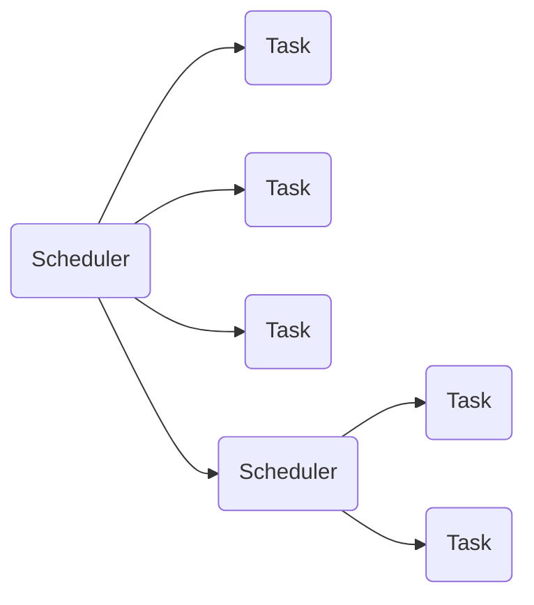

[](LICENSE)

# uCosm

Lightweight cooperative scheduler for microcontrollers.

- no heap allocation
- no task number limitation or pre-allocation
- platform independent
- scheduling tree
- customizable scheduling policy



This library provides a basic skeleton implementation in the _core_ directory, and two specialisations contained in the _periodic_ and _cfs_ (Completely Fair Scheduler) directories.

# Examples

## Periodic

```cpp
#include <iostream>
#include "periodic/iperiodic_task.hpp"

struct Task final : ucosm::IPeriodicTask {
    void run() override {
        std::cout << "run " << this->getPeriod() << std::endl;
        if(mCounter++ == 10) {
            this->remove();
        }
    }
    int mCounter = 0;
};
```

```cpp
#include <chrono>
#include "periodic/periodic_scheduler.hpp"

static ucosm::IPeriodicTask::tick_t getTick_ms() {
    static auto start = std::chrono::steady_clock::now();
    auto end = std::chrono::steady_clock::now();
    return static_cast<ucosm::IPeriodicTask::tick_t>(
        std::chrono::duration_cast<
            std::chrono::milliseconds
        >(end - start).count()
    );
}

int main() {

    ucosm::PeriodicScheduler sched(getTick_ms);

    Task t1;
    Task t2;

    t1.setPeriod(50);    // execute every 50 milliseconds
    t2.setPeriod(1000);  // execute every seconds

    sched.addTask(t1);
    sched.addTask(t2);

    while(!sched.empty()) {
        sched.run();
    }

    return 0;
}
```

## CFS

```cpp
#include <iostream>
#include "cfs/icfs_task.hpp"

struct Task final : ucosm::ICFSTask {
    void run() override {
        std::cout << "run " << (uint16_t)this->getPriority() << std::endl;
        if(mCounter++ == 10) {
            this->remove();
        }
    }
    int mCounter = 0;
};
```

```cpp
#include <chrono>
#include "cfs/cfs_scheduler.hpp"

int main() {

    ucosm::CFSScheduler sched(getTick_us);

    Task t1;
    Task t2;

    t1.setPriority(2);
    t2.setPriority(4);

    sched.addTask(t1);
    sched.addTask(t2);

    while(!sched.empty()) {
        sched.run();
    }

    return 0;
}
```

# Scheduler tree

In this library, the schedulers are also tasks. The task type can be passed as a template parameter to the scheduler.

Here we declare a periodic scheduler that schedules a CFS scheduler that schedules a periodic scheduler.

```cpp
ucosm::PeriodicScheduler<ucosm::ICFSTask> periodicScheduler(getTick_ms);

ucosm::CFSScheduler<ucosm::IPeriodicTask> cfsScheduler(getTick_us);

ucosm::PeriodicScheduler periodicScheduler2(getTick_ms);

cfsScheduler.addTask(periodicScheduler);

periodicScheduler2.addTask(cfsScheduler);
```

# Notes

The tasks storage is based on [ulink](https://github.com/ThomasAUB/ulink) and provides object lifetime safety which means that a task that is deleted will remove itself from its scheduler :

```cpp
void foo() {
    Task tempTask;
    sched.addTask(tempTask);
}// tempTask removes itself on deletion
```
