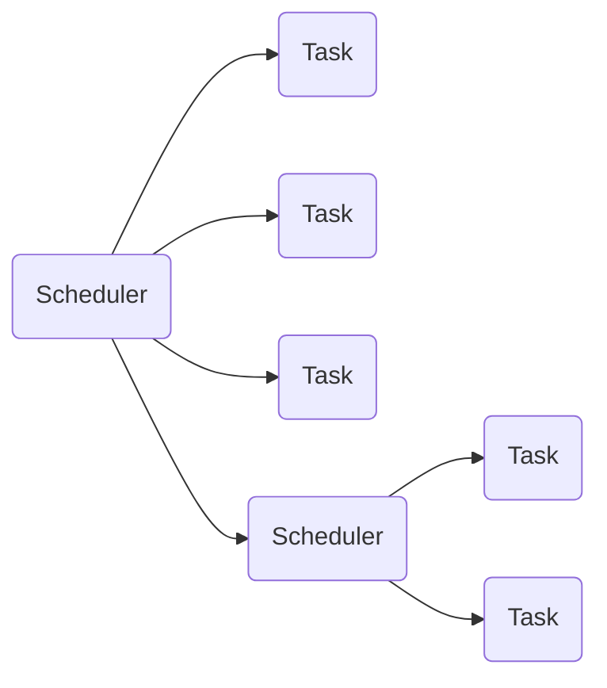

[](LICENSE)

# µCosm

A lightweight C++17 scheduler framework for microcontrollers that supports cooperative and real-time scheduling.

**Key Features:**
- **Zero heap allocation** - All operations use static memory
- **Unlimited task count** - No arbitrary limits on task numbers  
- **Platform independent** - Unified API for desktop and microcontrollers
- **Hierarchical scheduling** - Nest schedulers within schedulers
- **Two schedulers** - Cooperative periodic scheduling and interrupt-driven tasklets
- **Resumable tasks** - Coroutine-like behavior with macro system
- **Callable wrappers** - Lambda and function pointer support
- **Inter-context communication** - Lock-free queues and shared variables, usable from ISRs
- **Memory safety** - Automatic task lifetime management
- **High performance** - Optimized for embedded systems


This library provides a modular scheduling framework with two main implementations:

| Scheduler | Type | Execution | Use Case |
|-----------|------|-----------|----------|
| **Periodic** | Cooperative | Time-based intervals | Regular maintenance tasks |
| **Tasklet** | Deferred interrupt | Timer deadlines and ISR events | Work triggered from interrupts or hardware timers |

**Additional Components:**
- **Core**: Intrusive-list foundation (`IScheduler`/`ITask`/`ulink`) all schedulers build on — not a standalone scheduler
- **Resumable Tasks**: Macro-based coroutine system for stateful operations  
- **Callable Tasks**: Type-erased wrappers for lambdas and function pointers
- **Sync**: Lock-free message queue and shared variable for passing data between contexts

# Examples

## Periodic Tasks

Time-based cooperative scheduling where tasks execute at defined intervals.

```cpp
#include <iostream>
#include "periodic/iperiodic_task.hpp"

struct Task final : ucosm::IPeriodicTask {

    void run() override {

        std::cout << "run " << this->getPeriod() << std::endl;

        if(mCounter == 5) {
            // Dynamically change the execution period
            this->setPeriod(10);
        }

        if(mCounter == 10) {
            // Remove the task from its scheduler
            this->removeTask();
        }

        mCounter++;
    }
    int mCounter = 0;
};
```

```cpp
#include <chrono>
#include "periodic/periodic_scheduler.hpp"

static ucosm::IPeriodicTask::tick_t getTick_ms() {
    return static_cast<ucosm::IPeriodicTask::tick_t>(
        std::chrono::duration_cast<std::chrono::milliseconds>(
            std::chrono::system_clock::now().time_since_epoch()
        ).count()
    );
}

int main() {

    ucosm::PeriodicScheduler sched(getTick_ms);

    Task t1;
    Task t2;

    t1.setPeriod(50);    // Execute every 50 milliseconds
    t2.setPeriod(1000);  // Execute every second

    sched.addTask(t1);
    sched.addTask(t2);

    while(!sched.empty()) {
        sched.run();
    }

    return 0;
}
```

## Resumable Tasks

Resumable tasks provide coroutine-like functionality, allowing tasks to yield execution and resume later at the same point. This is particularly useful for implementing complex state machines, communication protocols, or multi-step operations without blocking other tasks.

**Key Features:**
- Zero heap allocation
- Minimal memory overhead
- Cooperative multitasking with explicit yield points
- Time-based delays and waiting
- Safe macro system for state management

```cpp
#include <iostream>
#include "ucosm/resumable/iresumable_task.hpp"

struct SequenceTask : ucosm::IResumableTask {
    
    void run() override {

        UCOSM_START;

        std::cout << "Step 1: Initialize" << std::endl;

        UCOSM_YIELD;  // Yield to other tasks, resume on next execution

        std::cout << "Step 2: Process" << std::endl;

        UCOSM_SLEEP_FOR(1000)  // Wait 1 second, then continue

        std::cout << "Step 3: Complete" << std::endl;

        UCOSM_END;  // Task completes and removes itself
    }
};
```

`IResumableTask` runs on a `PeriodicScheduler`. For a `TaskletScheduler`, derive from `IResumableTasklet` instead: the same macros apply, and `UCOSM_WAIT_EVENT(id)` suspends the task until the event is signaled. On a tasklet `UCOSM_YIELD` sleeps for one tick, since a tasklet period is at least 1.

```cpp
struct RxTask : ucosm::IResumableTasklet {

    void run() override {

        UCOSM_START;

        UCOSM_WAIT_EVENT(rx_event);  // resumes when signalEvent(rx_event) is called

        processFrame();

        UCOSM_SLEEP_FOR(10);

        UCOSM_RESTART;
    }
};
```

### Advanced Resumable Task Patterns

**State Machine Example:**
```cpp
struct StateMachineTask : ucosm::IResumableTask {

    int mAttempts = 0;
    int mRetries = 0;
    
    void run() override {

        UCOSM_START;

        std::cout << "Connecting..." << std::endl;

        UCOSM_SLEEP_FOR(500);  // Connection delay

        if (connectionSuccessful()) {
            std::cout << "Sending data..." << std::endl;
        }
        else {
            std::cout << "Connection failed, retrying..." << std::endl;
            UCOSM_RESTART;  // Restart from beginning
        }

        UCOSM_SLEEP_FOR(200);  // Send delay

        std::cout << "Waiting for response..." << std::endl;

        mRetries = 0;
        mAttempts = 0;

        // Timeout after 300ms
        UCOSM_SLEEP_UNTIL(responseReceived() || mRetries++ == 3, 100);

        if (responseReceived()) {
            std::cout << "Success!" << std::endl;
        }
        else if (++mAttempts < 3) {
            std::cout << "Timeout, retrying..." << std::endl;
            UCOSM_RESTART;
        }
        else {
            std::cout << "Max retries reached" << std::endl;
        }

        UCOSM_END;
    }
};
```

### Resumable Task Macros

| Macro | Description |
|-------|-------------|
| `UCOSM_START` | Begin the resumable task (required first macro) |
| `UCOSM_YIELD` | Yield execution, resume on next task execution |
| `UCOSM_SLEEP_FOR(tick)` | Wait for specified scheduler ticks before continuing |
| `UCOSM_SLEEP_UNTIL(condition, check_period)` | Wait until the condition becomes true |
| `UCOSM_RESTART` | Restart task from the beginning |
| `UCOSM_END` | End task and remove from scheduler |


### Using Resumable Tasks with Schedulers

Resumable tasks inherit from `IPeriodicTask`, so they can be used with any scheduler that accepts periodic tasks:

```cpp
#include "ucosm/periodic/periodic_scheduler.hpp"

int main() {
    ucosm::PeriodicScheduler sched(getTick_ms);
    
    SequenceTask task1;
    StateMachineTask task2;
    
    sched.addTask(task1);
    sched.addTask(task2);
    
    while(!sched.empty()) {
        sched.run();
    }
    
    return 0;
}
```

## Tasklet Scheduler and Tasks

The tasklet scheduler provides a safe, low-priority execution context for work that must be triggered from ISRs or other high-priority contexts. Instead of performing potentially long or blocking operations inside an interrupt, code can post a tasklet which will be executed later in a low-priority context (using `pendSV` on supported platforms).

- **Purpose**: Run work posted from ISRs or high-priority contexts without blocking interrupts.
- **Execution context**: Uses a low-priority PendSV (`pendSV`) to execute tasklets in a safe, low-priority thread of execution.
- **Triggering**: Tasks are triggered from ISRs or higher-priority code and identified by event IDs (`signalEvent`); the scheduler tracks timings to determine when tasklets should run.
- **API**: Implement tasks via `ITasklet` and register them with `TaskletScheduler` (see headers below).
- **Backend**: the platform hooks are a `TaskletBackend`, passed to the constructor and copied - `TaskletScheduler<event_count> sched(backend);`. `getTick` is required. The other hooks are optional : a null one is replaced by a no-op at construction, so that each hook costs an indirect call without a test.
- **Wake-up source**: a tasklet either runs on a period (`setPeriod`) or waits for an event (`waitForEvent`). A task that was configured with neither is refused by `addTask`.
- **Lifetime**: the configuration is kept across runs. A tasklet that doesn't reconfigure itself in `run()` is re-armed as it was, so `setPeriod` acts as a period like `IPeriodicTask` and `waitForEvent` keeps the subscription. The period is counted from the deadline the execution was due at, not from the tick the task happened to be dispatched at, so dispatch latency stays a one-off lateness instead of accumulating into the period. A task that comes back more than a period late - a coarse tick, a slow wake-up, or a callable longer than its own period - is counted from the moment it finished instead: the deadlines it could not have met are dropped rather than caught up on. A period of 0 means "as soon as possible", which for a tasklet is the next tick.
- **Delay**: like `IPeriodicTask` the delay lives in the task rank rather than in the task, so it is set through the scheduler - `addTask(task, delay)` when the first execution must not wait for a full period, and `setDelay(task, delay)` to re-arm a task that is already scheduled, which a task may call on itself from `run()` to shift its next execution. Only the next execution is affected, the period takes over afterwards.
- **Stopping**: a task may call `removeTask()` on itself from its own `run()`, or `dispose()` to clear the configuration - a task that disposes of itself from `run()` is unlinked, and can be scheduled again only after a new `setPeriod` / `waitForEvent`. From anywhere else, go through `scheduler.removeTask(task)`: it holds the execution lock, so it doesn't race the list walk the scheduler does from its dispatch context, and it refreshes the next deadline so a platform driven by `scheduleNextWakeup` stops waiting for a task that is gone.
- **Known issue**: destroying a tasklet that is still scheduled is not thread-safe. Its destructor unlinks it without the execution lock, which can corrupt the lists if the scheduler is dispatching at the same time. Always call `scheduler.removeTask(task)` before a tasklet is destroyed.
- **Clock**: the scheduler keeps no clock of its own. `TaskletBackend::getTick` is required and is read wherever the time is needed, the same role the `getTick` passed to `PeriodicScheduler` plays - a free running counter read is the intended shape, and a counter bumped by a tick interrupt does just as well.
- **Wake-up**: the clock alone never makes a task run, so the platform must provide one of two things. On a periodic tick, call `poll()` from the tick interrupt: it looks at the clock and pends the handler if a deadline has come round. On a one-shot timer, implement `scheduleNextWakeup` instead: it is handed each new next deadline, arms the timer on it, and no interrupt is taken in between - `poll()` is then never called. See `tests/arm_tasklet_executor.hpp` for the periodic shape.
- **Priority levels**: a scheduler dispatches its tasklets from one context, so tasklets of the same scheduler never preempt each other. For preemptive levels, create one `TaskletScheduler` per level, each with a backend whose `requestTaskletExecution` pends a different interrupt - PendSV for the lowest level, unused vectors pended through `NVIC_SetPendingIRQ` at higher NVIC priorities for the others.


## Inter-Context Communication

The `sync` headers pass data between contexts of different priorities - an ISR and a task, or two tasks - without locks or dynamic allocation. They don't depend on any scheduler.

- **`MessageQueue<T, Size>`**: lock-free single producer, single consumer queue holding `Size` messages, a power of 2. Bulk overloads - `trySend(messages, count)` and `tryReceive(messages, maxCount)` - move several messages for the cost of one.
- **`SharedVariable<T>`**: a single lock-free value, written from one context and readable from any. Each `store()` bumps a version, so a reader can tell with `hasChanged()` whether the value was updated since it last looked.

Both are tuned for small MCUs: no read-modify-write, and a send or a receive usually costs a single memory barrier. When every context sharing them runs on one core - thread mode and ISRs of a single-core MCU - define `UCOSM_SINGLE_CORE=1` to drop the barriers too: a core observes its own accesses in program order, so only compiler reordering has to be prevented. Leave it undefined for objects shared between the cores of a multi-core part (RP2040, STM32H7 dual-core...).

```cpp
#include "ucosm/sync/message_queue.hpp"

struct SensorData {
    uint32_t timestamp;
    float temperature;
};

ucosm::MessageQueue<SensorData, 16> sensorQueue;

// Producer (ISR or high priority task)
void onSensorReady() {
    if (!sensorQueue.trySend(readSensor())) {
        // queue full - handle overflow
    }
}

// Consumer (lower priority task)
struct ProcessorTask : ucosm::IPeriodicTask {
    void run() override {
        SensorData data;
        while (sensorQueue.tryReceive(data)) {
            process(data);
        }
    }
};
```

### Waking a tasklet on a message

`TaskletQueue` pairs a `MessageQueue` with a tasklet scheduler event: each successful `trySend()` signals the event, so the tasklet waiting for it runs and receives the message, instead of polling the queue. Events are coalesced, so `run()` must drain the queue.

```cpp
#include "ucosm/tasklet/tasklet_queue.hpp"

constexpr ucosm::event_id_t uart_rx_event = 0;

ucosm::TaskletScheduler<1> sched(backend);
ucosm::TaskletQueue<uint8_t, 64, 1> rxQueue(sched, uart_rx_event);

struct RxTask : ucosm::ITasklet {
    void run() override {
        uint8_t byte;
        while (rxQueue.tryReceive(byte)) {
            parse(byte);
        }
    }
} rxTask;

extern "C" void UART_IRQHandler() {
    rxQueue.trySend(UART->DR);
}

int main() {
    rxTask.waitForEvent(uart_rx_event);
    sched.addTask(rxTask);
    // ...
}
```


## Callable Tasks

For simple tasks that don't require full class definitions, `CallableTask` provides a convenient wrapper that can store lambdas, function pointers, and member functions.

**Key Features:**
- Small buffer optimization (no heap allocation for small callables)
- Support for lambdas, function pointers, and member functions  
- Safe empty callable handling

```cpp
#include "ucosm/core/callable_task.hpp"

int main() {
    ucosm::PeriodicScheduler sched(getTick_ms);
    
    int counter = 0;
    
    // Lambda task
    ucosm::CallableTask<ucosm::IPeriodicTask> lambdaTask(
        [&counter]() {
            std::cout << "Counter: " << ++counter << std::endl;
        }
    );
    
    // Member function task
    struct MyClass {
        void doWork() { std::cout << "Member function called" << std::endl; }
    } myObject;
    
    ucosm::CallableTask<ucosm::IPeriodicTask> memberTask(&MyClass::doWork, myObject);
    
    lambdaTask.setPeriod(100);
    memberTask.setPeriod(200);
    
    sched.addTask(lambdaTask);
    sched.addTask(memberTask);
    
    while (!sched.empty()) {
        sched.run();
    }
    
    return 0;
}
```

# Hierarchical Scheduling

Schedulers can be nested as tasks within other schedulers, enabling sophisticated scheduling topologies for complex systems.


```mermaid
flowchart LR

scheduler(Scheduler)

task1(Task)
task2(Task)
task3(Task)
schedTask(Scheduler)
schedTask
subTask1(Task)
subTask2(Task)

scheduler --> task1
scheduler --> task2
scheduler --> task3
scheduler --> schedTask

schedTask --> subTask1
schedTask --> subTask2
```

Schedulers can also be executed from the idle function of higher-priority schedulers.

```cpp

ucosm::PeriodicScheduler& lowPrioScheduler() {
    static ucosm::PeriodicScheduler sLowSched(getTick_ms);
    return sLowSched;
}

ucosm::PeriodicScheduler& mediumPrioScheduler() {
    static ucosm::PeriodicScheduler sMediumSched(
        getTick_ms,
        +[]() { // idle function
            lowPrioScheduler().run();
        }
    );
    return sMediumSched;
}

ucosm::PeriodicScheduler& highPrioScheduler() {
    static ucosm::PeriodicScheduler sHighSched(
        getTick_ms,
        +[]() { // idle function
            mediumPrioScheduler().run();
        }
    );
    return sHighSched;
}

int main() {

    while(true) {
        highPrioScheduler().run();
    }

    return 0;
}

```

# Memory Safety

Task storage uses [ulink](https://github.com/ThomasAUB/ulink) for automatic lifetime management. Tasks automatically remove themselves from schedulers when destroyed.

```cpp
void foo() {
    Task tempTask;
    sched.addTask(tempTask);
} // tempTask removes itself from the scheduler at the end of the scope
```

